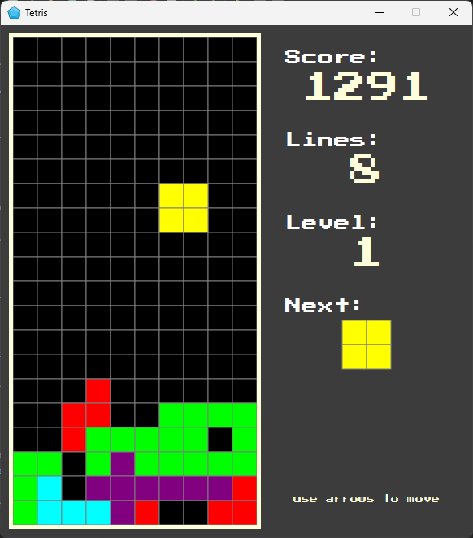
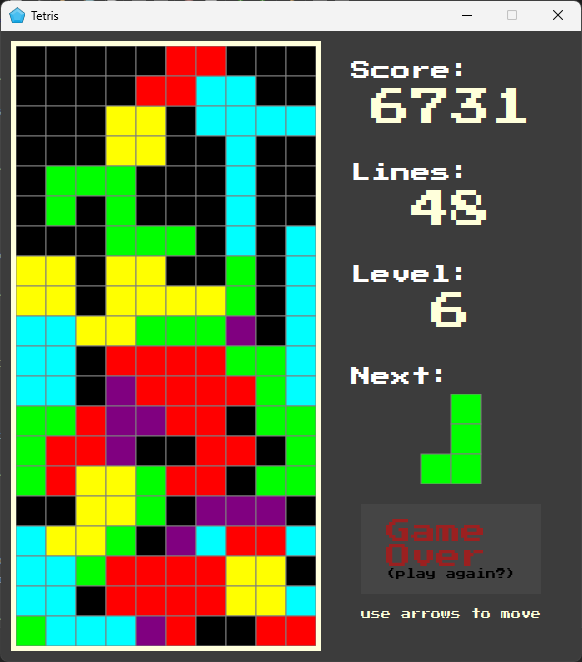

# Tetris

A simple Tetris clone written in Java using JavaFX.

Includes score and level system, where higher levels increase game speed.

<p align="center">
  
  
</p>

### Controls (arrow keys):
← → move, ↓ drop, ↑ rotate


## Download

Prebuilt app is available in the GitHub Releases page:

https://github.com/david-soliar/Tetris/releases


## Building and Running
Requirements:
- Java 21
- Maven

### Run (dev)
```
mvn javafx:run
```

### Build native app
```bash
mvn clean package

mvn dependency:copy-dependencies -DincludeScope=runtime -DoutputDirectory=deps

jlink --module-path "$JAVA_HOME/jmods:deps" \
      --add-modules javafx.controls \
      --output runtime

jpackage --name Tetris \
         --input target \
         --main-jar Tetris.jar \
         --main-class davidsoliar.tetris.App \
         --runtime-image runtime \
         --type app-image \
         --dest dist
```
